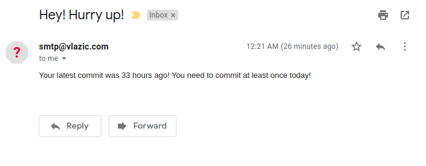

# We Are Talking About Practice

Do you want to be a better programmer?

Yes, we are talking about practice, man!

I've decided to code at least 3 hours per day while publishing at least one commit to Github.
At 22h if I dont achieve this goals I will receive email like this:


Do you want to try it yourself?
Follow instructions:

## Instructions

1. Start using [WakaTime](http://google.com), so you can track how much time you spend coding
2. Clone this repo `git clone https://github.com/vlazic/we-are-talking-about-practice` on your server
3. Create `.env` file `cp .env.example .env` and change sample data:

```ini
# your email
TO_EMAIL=kody.stehr19@ethereal.email

# notify if there is no commits in last COMMIT_HOURS_WARNING hours
# this should probably match hour at which cronjob is running this script
COMMIT_HOURS_WARNING=22

# notify if number of coding hours is bellow this value
CODING_HOURS_WARNING=3

# Your Github username
GITHUB_USER=vlazic

# Your WakaTime API key
WAKATIME_API=39a81265-5a52-4192-8112-e0b16b4819dc

# SMTP server info
SMTP_HOST=smtp.ethereal.email
SMTP_PORT=587
SMTP_USER=kody.stehr19@ethereal.email
SMTP_PASS=NAsSRCgwcWa24DBFRc
SMTP_FROM_MAIL=kody.stehr19@ethereal.email

```

4. Install dependencies: `npm install`
5. Build it `npm run build`
6. Create cron job: `0 22 * * * node PATH_TO_REPO/dist/index.js`

## Alternate Instructions

Practice by creating your own similar script which suits you better. This one is bloated because I wanted to try Node with Typescript :)


https://www.youtube.com/watch?v=eGDBR2L5kzI
